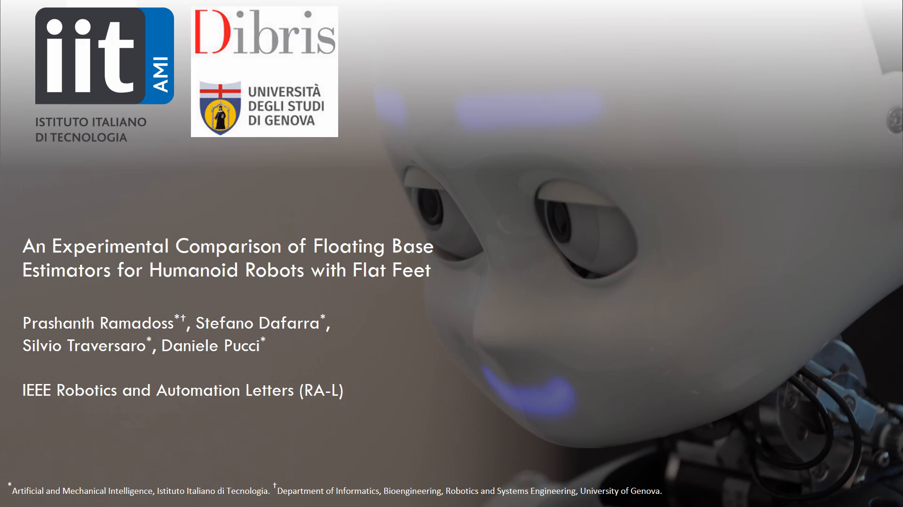

<h1 align="center">
An Experimental Comparison of Floating Base Estimators for Humanoid Robots with Flat Feet
</h1>

Prashanth Ramadoss, Stefano Dafarra, Silvio Traversaro, Daniele Pucci

  IEEE Robotics and Automation Letters (RA-L)

<a href="#installation-and-usage"><b>Installation and Usage</b></a> |
<b>Paper</b> |
<b>Video</b>

### Installation and Usage

Please refer to the documentation in [docs/usage.md](./docs/usage.md).

### Citing this work

To be updated.

### Acknowledgements

- We would like to acknowledge the author of the repository https://github.com/NewGuy012/spider_plot which has been used to construct the error metrics comparison charts.

### Maintainer

This repository is maintained by:

| | |
|:---:|:---:|
|  | [Prashanth Ramadoss](https://github.com/prashanthr05) |
